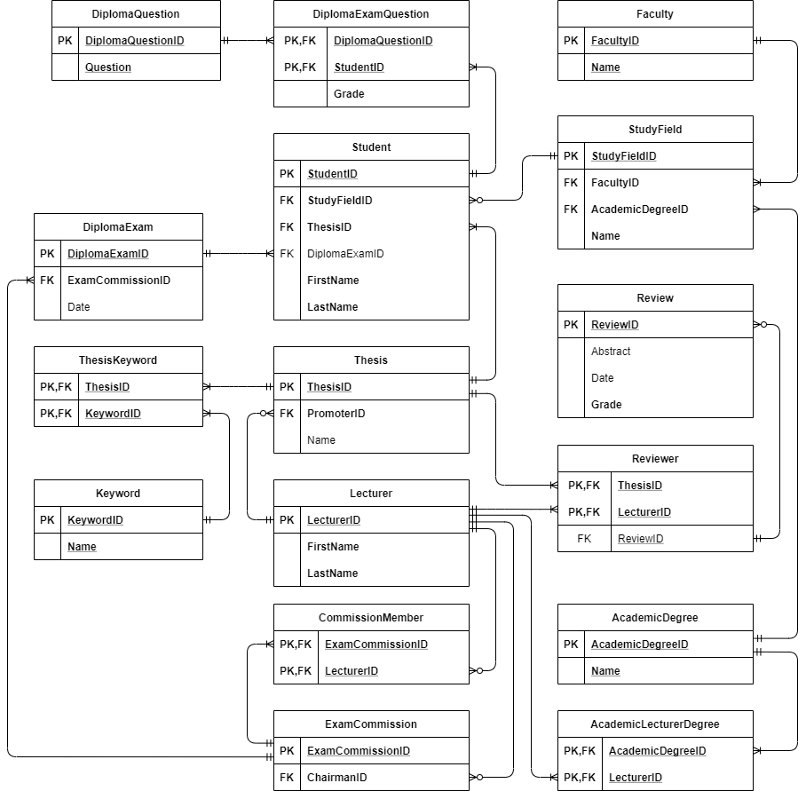

# Diploma Thesis Service Database

T-SQL ddl scripts for creating a database for diploma thesis
management. Scripts perform many operations like:
* create schemas
* create tables according to ERD shown below
* create views (Thesis report, Review report, Exam report)
* create triggers for INSERT, UPDATE statements
 (prevent the student from the having more than 1 thesis in database,
  check if commision have appropriate members number,
  prevent the chairman of being a regular commission member)
* create procedures and functions (helpers for above operations)
* drop all schemas
* drop all tables

---

## Screenshot



---

## Technology
* T-SQL
---

## Requirements
* Operation system: Windows
* Microsoft SQL Server Management Studio
---

## Running
1. Create a database with the selected name for ex.: DiplomaThesisService in 
   SQL Server Management Studio
2. Open the choosen script
3. Run the script on the selected database by clicking a Exectue button (Alt + X)

* Scripts to work properly have to be run in the specific order: <br>
create_schemas.sql -> create_tables.sql -> create_functions.sql && create_procedures.sql ->
create_triggers.sql || create_views.sql -> drop_all_tables.sql -> drop_all_schemas.sql
---

## Example of use
After creating a database and running scripts you can add your own statements like
insert data into table for ex.:
```
INSERTO INTO
    University.Faculty (StudyField)
VALUES
    ("Information Technology");
```
